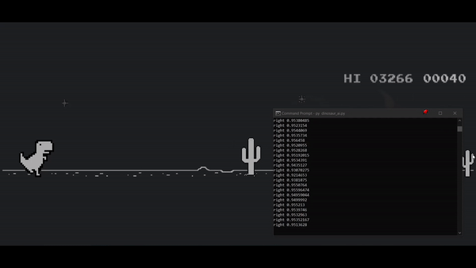

# Chrome Dinosaur Game AI with Neural Networks

This is a densely connected artificial neural network trained to play the famous [Chrome dinosaur game](chrome://dino). I initially planned to implement this with a convolutional neural network, however, taking a step back to what I already knew, I was curious to see how well a regular ANN would work given such a task.

The approach I took here was to collect training data based on the keys pressed when playing the game. For example, a screenshot stored in the "up" folder would correspond to when I press the up arrow key when playing the game. When training the model, this leads to an image classification problem where the model classifies the gameplay image into the correct keys to press. Finally, this allows the gameplay script to automatically press the correct keys (hopefully) based on the predicted classes.

The current model performs with a accuracy of 96% on a test set and has a high score of 600+

## Network Architecture

The NN is a 3 layer densely connected neural network.

- The input layer has 1600 units corresponding to a 40x40 image of the processed screenshot passed into the network.
- The hidden layer has 1000 units.
  - There is a rule of thumb that states using 2/3 of the number of input neurons + output neurons.
  - The number I chose is loosely based on that by rounding down 2/3 \* 1600 (1066 -> 1000) and omitting the number of output neurons.
- The output layer has 3 units corrensponding to the possible game moves to make: up, down or right.

## Limitations

1. Running the game, either for obtaining training data or actually using the AI is only possible on the main display (eg. the laptop screen instead of an external display)
2. My browser is in dark mode and the game starts off at night for me. I don't currently know if it works well during the day time mode of the game.
3. The current model isn't well trained in ducking situations due to less training data for this.

## Getting Started

Feel free to experiment with the model/code. The one major thing you may need to do first is to run `pip install requirements.txt` to ensure that you have the right dependencies.

### Gathering Your Own Training Data

If you'd like to run the `get_training_data.py` script and create your own training data, do the following:

1. Open [chrome://dino/](chrome://dino/) (make sure it's in full browser and on your main display)
2. Run the script.
3. Press space when you're ready to start the game.
4. Play the game (try to press keys only when necessary to obtain more accurate screenshots since it's dependent on your action)
5. Once the game is over, press escape to stop the script (you may need to manually remove excess images that are of the game over screen)
6. Train the neural network by running the `model_training.ipynb` notebook.

> Screenshots can sometimes be inaccurate and may need manual judgement to filter out those that might not benefit the model.

### Playing with the AI

If you'd like to just let the trained AI have fun, do the following:

1. Open chrome://dino/ (make sure it's in full browser and on your main display)
2. Run `dinosaur_ai.py`.
3. Press space when you're ready to start the game.
4. Watch the dino have fun.

## References

1. Getting screenshots in Python

   - https://pillow.readthedocs.io/en/stable/reference/index.html
   - http://chayanvinayak.blogspot.com/2013/03/bounding-box-in-pilpython-image-library.html

2. Screenshotting an image and using it with OpenCV without saving

   - https://www.pyimagesearch.com/2018/01/01/taking-screenshots-with-opencv-and-python/

3. Working with the Sequential model and training parameters in Tensorflow

   - https://www.youtube.com/watch?v=MQD1yMnZ_jk
   - https://www.youtube.com/watch?v=_8Bydxud1XU
   - https://www.tensorflow.org/guide/keras/train_and_evaluate

4. The softmax activation function for the output layer

   - https://deepai.org/machine-learning-glossary-and-terms/softmax-layer

5. Tensorflow callbacks and getting the optimal number of epochs

   - https://www.geeksforgeeks.org/choose-optimal-number-of-epochs-to-train-a-neural-network-in-keras/
   - https://blog.paperspace.com/tensorflow-callbacks/

6. Working with and visualising model history

   - https://machinelearningmastery.com/display-deep-learning-model-training-history-in-keras/

7. Learning curves for diagnosing model performance

   - https://machinelearningmastery.com/learning-curves-for-diagnosing-machine-learning-model-performance/
